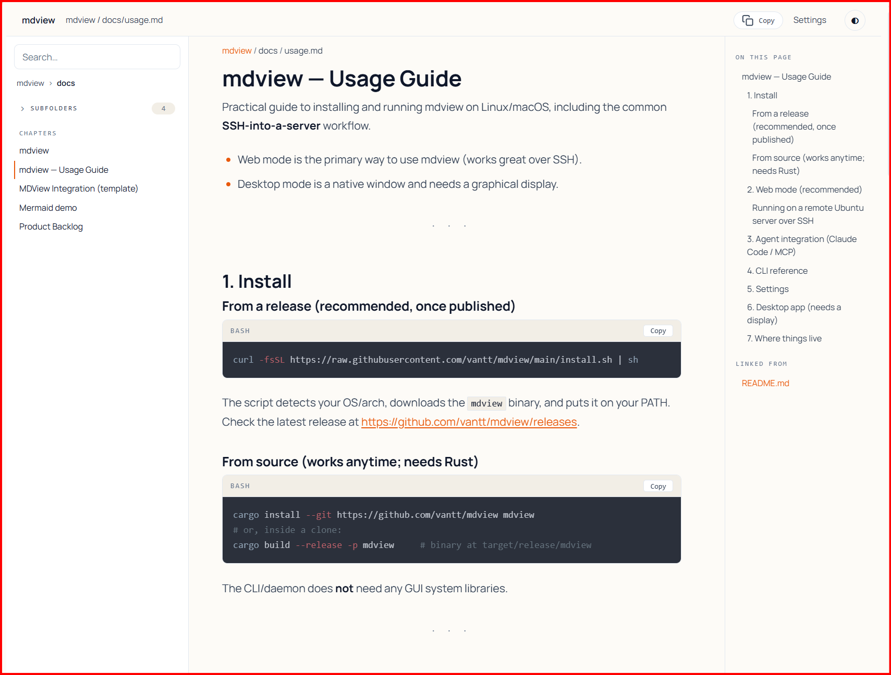
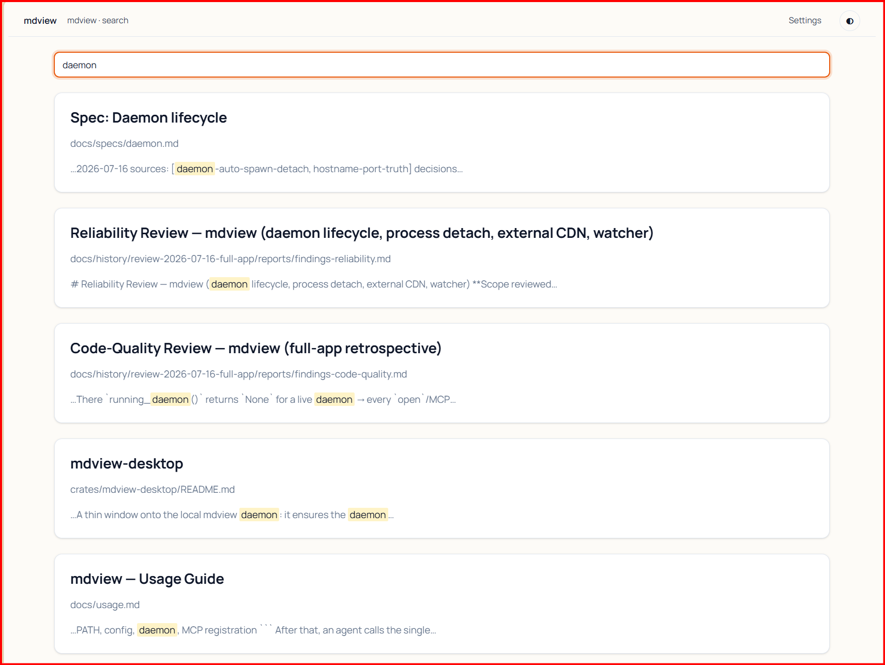
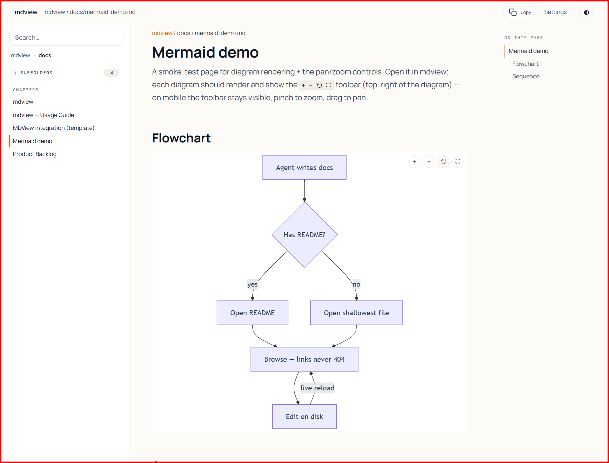
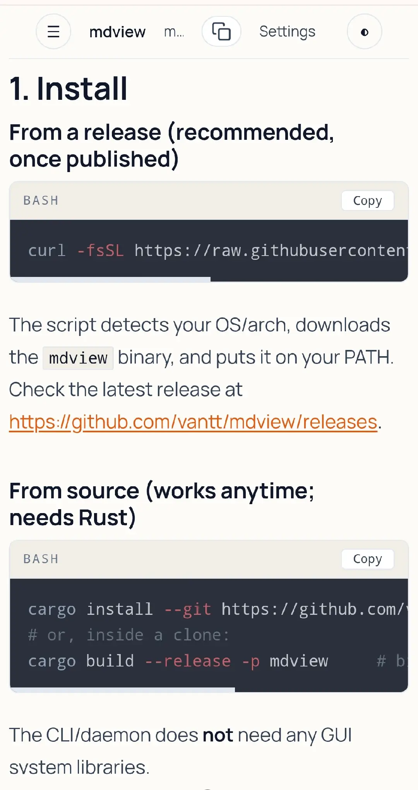

<h1 align="center">mdview</h1>

<p align="center">
  <strong>The markdown viewer built for the docs your AI agent actually writes.</strong>
</p>

<p align="center">
  <a href="LICENSE"></a>
  
  
  
</p>

<p align="center">
  One command turns a sprawling, multi-folder pile of markdown into a fast, linked,
  live-reloading site in your browser — <strong>cross-folder links that never 404</strong>,
  full-text search, Mermaid diagrams you can zoom, and a one-call hook so your AI agent
  can open any doc it just wrote.
</p>

<!-- ▶ HERO DEMO — add docs/assets/hero-demo.gif (or .mp4), then uncomment:
<p align="center">
  
</p>
-->

---

## Why mdview?

AI coding agents generate docs like a firehose: nested folders, `../src/api/README.md`
links, Mermaid diagrams, tables, long code blocks. Open that in a typical single-folder
viewer and half the links 404, there's no search, and every edit means a manual refresh.

mdview serves the **whole project** — at any folder depth — rewrites every internal link
into its own URL namespace, and live-reloads on save. The docs your agent generates just… work.

| | |
|---|---|
| 🔗 **Nothing 404s** | Every internal link across every folder is resolved into one URL namespace. Click straight through `../`, `./sub/`, anchors — no dead ends. |
| ⚡ **Live reload** | A filesystem watcher pushes changes over WebSocket. Save on disk, the page updates itself. |
| 🔍 **Find anything** | Full-text search across the entire project (SQLite FTS5) plus fuzzy file-jump. |
| 📊 **Diagrams that move** | Mermaid renders client-side with pan / zoom / fullscreen — and pinch-to-zoom on mobile. |
| 📋 **Copy-ready code** | Syntax-highlighted code blocks with a one-tap copy button. |
| ✏️ **Edit in place** | Hit Edit on any doc, fix it in a CodeMirror editor with markdown highlighting, Ctrl+S saves straight to disk and re-renders. Refuses to clobber a file your agent changed meanwhile. |
| 🤖 **Agent-native** | `mdview open --json <file>` (or the `mdview_view_file` MCP tool when there is no shell) hands your agent a clickable URL the moment it writes a doc. |
| 📱 **Read anywhere** | Responsive layout, mobile sidebar drawer, light & dark. Browse from your phone over the LAN or an SSH tunnel. |
| 🦀 **One binary** | Written in Rust. No runtime, no Node, no Docker. Install and go. |

---

## See it

<!-- ▶ SCREENSHOTS — see "Media checklist" at the bottom for exact shots/sizes. -->
<table>
  <tr>
    <td width="50%"><br><em align="center">Reading view — file tree, rendered doc, live TOC</em></td>
    <td width="50%"><br><em>Project-wide full-text search</em></td>
  </tr>
  <tr>
    <td><br><em>Mermaid with pan / zoom / fullscreen</em></td>
    <td><br><em>Mobile — sidebar drawer, pinch-zoom diagrams</em></td>
  </tr>
</table>

---

## Install

```sh
curl -fsSL https://raw.githubusercontent.com/vantt/mdview/main/install.sh | sh
mdview doctor --fix     # let agents run `mdview open` and install the /mdview skill
```

Windows (PowerShell):

```powershell
irm https://raw.githubusercontent.com/vantt/mdview/main/install.ps1 | iex
mdview doctor --fix     # let agents run `mdview open` and install the /mdview skill
```

Or from source (needs Rust):

```sh
cargo install --git https://github.com/vantt/mdview mdview
```

---

## Agent integration (CLI first)

```
mdview doctor --fix
```

Agents call the CLI: `mdview open --json <absolute-path-to-file.md>` prints a JSON object
with `url`, `urls`, `long_url`, `long_urls`, `path`, `code` and `project_id`, auto-registering
the project and starting the daemon. `doctor --fix` adds the Claude Code permission
`Bash(mdview open:*)` to `~/.claude/settings.json` (after a timestamped backup; a settings
file that is not valid JSON is never touched), installs the `/mdview` skill, and syncs the
agent instruction block. It no longer registers the MCP server by default.

For agents with no shell, opt in to MCP:

```
mdview doctor --fix --mcp
```

This registers an MCP server with **Claude Code, Codex, and Antigravity** (for whichever it
detects) exposing **`mdview_view_file(project_root, relative_path)`**, which returns the same
fields.

Drop the snippet from [`docs/mdview-agents-template.md`](docs/mdview-agents-template.md)
into your project's `AGENTS.md` / `CLAUDE.md`, and your agent will surface a viewable URL
the moment it finishes writing docs.

**Indexing is on demand.** Nothing scans the whole repo in the background: a file is
indexed when its URL is opened (together with its link targets and sibling markdown files),
and a project is fully indexed on its first content search. `mdview refresh` forces a full
sync. Projects idle for 14 days are cleaned up automatically.

**Upgrading.** The registry is rebuilt as `~/.mdview/registry-v4.db` (it is a disposable
cache); `doctor --fix` removes the old `registry.db`. A running daemon from an older build is
restarted automatically the next time the CLI needs it. Restart your agent sessions so old
`mdview mcp` processes exit; older builds keep using `registry.db`.

<!-- ▶ OPTIONAL VIDEO — agent → view_file → browser. See "Media checklist". -->

---

## Use in 30 seconds

```sh
mdview open docs/architecture.md
```

That's it. The daemon **auto-starts**, indexes the file and its neighbours, resolves the links, and prints
a browser URL. Open <http://localhost:7700> to browse every project; edits on disk
live-reload the page.

**From inside an AI agent (Claude Code, Codex, …):** say your agent just wrote
`docs/spec/prd.md`. Two ways to see it:

- **Skill:** run `/mdview docs/spec/prd.md` in the agent's terminal — it replies with a URL to open.
- **Agent wired up (`doctor --fix`)?** No need to ask — the agent runs `mdview open --json`
  itself (or calls `mdview_view_file` over MCP) and hands you the URL right after it
  finishes writing the file.

**Reading from a remote server over SSH?** Forward the port and browse locally:

```sh
ssh -L 7700:localhost:7700 user@host   # then open http://localhost:7700
```

> mdview can also bind your LAN (`mdview serve --host 0.0.0.0`) to read from a phone or
> another machine. Sign-in is required (a login token, auto-generated on first start —
> or Cloudflare Access, if you configure it) — details in the [usage guide](docs/usage.md).

---


## CLI

```sh
mdview open <file.md>                # print the browser URL (auto-starts the daemon)
mdview register <dir> [--name ...]   # register a project (indexed on view/search)
mdview search "query"                # full-text search (FTS5)
mdview status                        # is the daemon up?
mdview config edit                   # edit ~/.mdview/config.toml in $EDITOR
mdview restart                       # restart the daemon (apply config changes)
mdview doctor [--fix] [--mcp]        # diagnose & repair the integration
mdview serve [--host H] [--port P]   # optional: pre-start / bind a custom address
```

Most commands accept `--json` for scripting. Full reference, SSH workflows, settings, and
the desktop app live in the **[usage guide](docs/usage.md)**.

---

## How it works

One daemon owns the registry (`~/.mdview/registry-v4.db`); browser tabs are just clients. On an
`open` / `view_file` call the server auto-creates the project, indexes the target file (plus its
link targets and sibling markdown files), and returns the URL; the whole project is indexed on
its first content search. A filesystem watcher keeps the index current
and pushes a reload signal over WebSocket.

- **Rendering:** comrak (GFM) → server-side syntect highlight → ammonia sanitize. Mermaid renders client-side.
- **Search:** SQLite FTS5.
- **Safety:** only registered project roots are served; path traversal is guarded and project HTML is sanitized before it's sent.

---

## Status

Actively developed. Core viewer, project-wide search, MCP + CLI + `doctor`, and the mobile
UX are working end-to-end; a native desktop shell (Tauri) is experimental. See
[PRD.md](PRD.md) for the full design.

---

## Credits

mdview is an independent project, but its design leans on ideas and hard-won lessons from two
prior open-source markdown servers. Grateful thanks to both:

- **[mdserve](https://github.com/jfernandez/mdserve)** — Jose Fernandez, MIT. Watcher
  robustness across atomic editor saves, WebSocket reload-signal live reload, the
  pre-render-to-memory pipeline, path-traversal guarding, and port auto-increment on bind conflict.
- **[marky](https://github.com/GRVYDEV/marky)** — GRVYDEV, Apache-2.0. Recursive folder tree
  that respects `.gitignore`, atomic corrupt-resilient settings persistence,
  sanitize-before-serve, and nucleo-backed fuzzy search.

## License

MIT — see [LICENSE](LICENSE).
