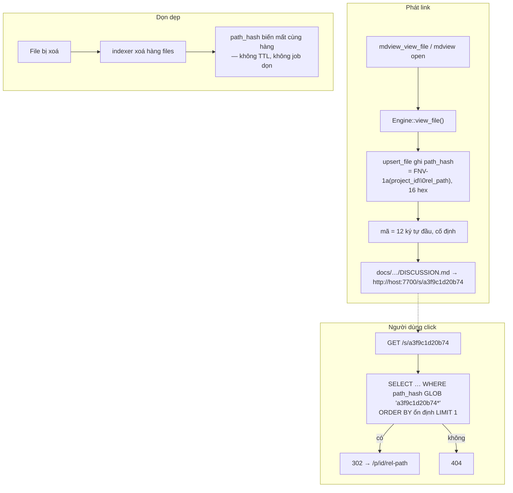

# Thảo luận: shortlink cho URL file của mdview

## 1. Trạng thái hiện tại

Vòng 5 (2026-08-12). **Thảo luận đã hội tụ.** Item fgOS: **`tsk-3sl`**.

Toàn bộ 10 quyết định đã chốt và ghi bằng `fgos decision --id tsk-3sl`
(§4). Điểm gãy cuối cùng — độ dài mã — đã giải xong ở vòng 4–5 theo hướng
người dùng đề xuất: **cố định 12 hex** (D10) thay cho prefix co giãn
(D4). Việc đó xoá luôn câu hỏi Q10 về nhập nhằng, cùng với hàm
prefix-ngắn-nhất và nhánh xử lý nhập nhằng — thiết kế gọn hơn hẳn so với
vòng 3.

§6 đã được **sinh lại trọn vẹn** theo D10. §7 rút còn 3 task với T2/T3
nhẹ hơn trước.

Nhận định cốt lõi giữ nguyên từ vòng 1: **nhu cầu "auto cleanup" chỉ tồn
tại nếu shortlink là thực thể mới có vòng đời riêng.** Cột hash sống-chết
cùng hàng `files`, mà indexer đã tự xoá hàng khi file biến mất ⇒ không có
gì để dọn, không TTL, không job.

Không còn câu hỏi mở. Bước kế tiếp là bàn giao sang `fgos-coding-exploring`
→ `fgos-coding-planning`.

## 2. Mục tiêu & đề bài

Khi agent gọi `mdview_view_file` (hoặc `mdview open`), mdview trả về một
URL đầy đủ dạng `http://<host>:<port>/p/<project-id>/<rel-path>`. Với các
file nằm sâu — ví dụ `docs/history/fgos-coding-shaping/DISCUSSION.md` —
URL dài tới ~77 ký tự, vượt bề rộng terminal, bị ngắt dòng, và khi bị ngắt
dòng thì terminal không còn nhận ra nó là một link nữa nên người dùng
không click được; phải bôi đen copy thủ công. Mục tiêu là trả về một link
đủ ngắn để không bao giờ rớt dòng, sao cho trải nghiệm click-là-mở mượt
nhất, đồng thời cơ chế đứng sau phải nhẹ nhất và sạch nhất có thể —
không thêm kho lưu trữ, không thêm vòng đời phải quản lý, và nếu có sinh
ra trạng thái thì trạng thái đó phải tự dọn chứ không cần một cơ chế dọn
dẹp riêng.

## 3. Vấn đề rõ / chưa rõ

| # | Vấn đề | Trạng thái | Ghi chú |
|---|--------|-----------|---------|
| V1 | URL dài gây rớt dòng → mất clickable | **Rõ** | Đo thực tế: 77 ký tự cho một file docs/history bình thường; riêng `http://127.0.0.1:7700` đã chiếm 21 |
| V2 | Namespace URL gốc có trống cho route mới không | **Rõ** | `server.rs:106-109` chỉ dùng `/`, `/health`, `/api/*`, `/settings`, `/static/*`, `/ws`, `/p/:id/*` — `/s/` và `/f/` còn trống |
| V3 | Có cần bảng lưu shortlink không | **Rõ** | Không. Mã dẫn xuất từ `(project_id, rel_path)` đã có sẵn trong bảng `files` |
| V4 | Có cần TTL/GC không | **Rõ (hệ quả V3)** | Không. Vòng đời mã = vòng đời hàng `files`, mà indexer đã tự xóa hàng khi file biến mất |
| V5 | rowid có ổn định không | **Rõ** | Có, qua re-index (`ON CONFLICT DO UPDATE`, `repository.rs:94-109`) — nhưng **bị tái sử dụng** sau khi hàng bị xóa |
| V6 | Thay thế hay bổ sung URL dài trong output | **Rõ (vòng 2)** | Thay thế: in link ngắn, kèm tên file dạng text thường cùng dòng để đọc lại lịch sử vẫn biết là file nào |
| V7 | Redirect 302 hay serve nội dung ngay tại URL ngắn | **Rõ (vòng 2)** | Redirect 302 về `/p/<id>/<rel>`; tái dùng nguyên `project_path`, không đụng logic resolve link tương đối |
| V8 | Độ dài mã | **Rõ (vòng 5)** | Vòng 2 chốt co giãn (D4), vòng 4–5 lật lại: **cố định 12 hex** (D10). Cột vẫn lưu hash đầy đủ 16 hex |
| V9 | Trường hợp bind wildcard trả N URL theo N IP máy | **Rõ (vòng 2)** | Có `hostname` override ⇒ trả đúng 1 link; không có ⇒ giữ nguyên danh sách nhiều IP |
| V10 | Mã trỏ tới file đã bị xóa khỏi index | **Rõ (vòng 2)** | 404 |
| V11 | CLI `mdview open` có dùng chung cơ chế không | **Rõ (vòng 3)** | Có — in link ngắn giống MCP |
| V12 | Prefix co giãn có thể nhập nhằng theo thời gian | **Không còn tồn tại (vòng 5)** | D10 (cố định 12 hex) xoá bỏ prefix co giãn ⇒ vấn đề tan cùng với câu hỏi Q10. Trường hợp hai file trùng đủ 12 hex (kỳ vọng 1,8×10⁻⁵ ở quy mô 100k file) xử lý bằng `ORDER BY` ổn định + `LIMIT 1` |
| V13 | Nguồn hàm hash | **Rõ (vòng 3)** | FNV-1a 64-bit tự viết. `std::DefaultHasher` bị loại vì thuật toán có thể đổi giữa các bản Rust ⇒ link cũ chết sau khi nâng toolchain |
| V14 | Chọn biến thể resolve A1 / A2 / A3 | **Rõ (vòng 3)** | **A3** — cột hash + index. Người dùng chọn ngược với đề xuất A1; đổi lấy tốc độ, cái giá là repo có migration framework đầu tiên |
| V15 | Có cơ chế migration DB không | **Rõ (vòng 2)** | **Không có.** `repository.rs:30-37` chỉ chạy `CREATE TABLE IF NOT EXISTS`. A3 sẽ phải tự dựng `ALTER TABLE` + backfill + `PRAGMA user_version` |

## 4. Quyết định đã chốt

Item fgOS: `tsk-3sl`. Mỗi dòng dưới đây đã được ghi bằng
`fgos decision --id tsk-3sl` (vòng 3).

| D-ID | Quyết định | Lý do |
|------|-----------|-------|
| D1 | Mã ngắn **dẫn xuất** từ `(project_id, rel_path)` đã có trong index; không tạo bảng shortlink riêng | Cleanup/TTL chỉ cần khi shortlink là thực thể có vòng đời riêng. Mã sống-chết cùng hàng `files`, mà indexer đã tự xóa hàng khi file biến mất |
| D2 | Output **thay thế** URL dài bằng link ngắn, kèm tên file dạng text thường cùng dòng | Giữ tính đọc-là-biết-file-nào mà không kéo dài dòng gây rớt dòng terminal |
| D3 | `/s/<code>` trả **302 redirect** về `/p/<id>/<rel>`, không serve nội dung trực tiếp | Tái dùng nguyên `project_path`, không phải xử lý lại resolve link tương đối. Vấn đề rớt dòng nằm ở terminal, không ở trình duyệt |
| D4 | ~~Độ dài mã **co giãn** kiểu git — prefix ngắn nhất còn duy nhất tại thời điểm sinh~~ **(bị D10 thay thế ở vòng 5)** | Không cố định độ dài; tự nới khi đụng trùng, giữ link ngắn nhất có thể |
| D5 | Có `hostname` override ⇒ trả đúng 1 link; không có ⇒ giữ nguyên danh sách nhiều IP | Khi hostname đã xác định thì danh sách IP là nhiễu; khi bind wildcard không hostname thì người dùng cần tự chọn IP routable |
| D6 | Mã không resolve được về file đang index ⇒ **404** | File đã rời index thì không có gì đúng để hiển thị; không đoán |
| D7 | Resolve theo biến thể **A3** — cột `path_hash` + index trong bảng `files`; không cache RAM, không quét toàn bảng | O(log n) qua index; chỉ một đường ghi (`upsert_file`) nên không có bản sao nào lệch được. Cái giá: repo phải có bước migration đầu tiên |
| D8 | Hàm băm là **FNV-1a 64-bit tự viết** trong `mdview-core`, không thêm dependency | `std::DefaultHasher` có tài liệu nói rõ thuật toán có thể đổi giữa các bản Rust ⇒ mã chết sau khi nâng toolchain. Không có yêu cầu chống đối thủ vì server vốn không xác thực |
| D9 | CLI `mdview open` in link ngắn **cùng định dạng với MCP** | Cùng một vấn đề rớt dòng ở cả hai lối vào; dùng chung đường sinh mã trong `Engine::view_file` |
| D10 | Mã có **độ dài cố định 12 hex** — **thay thế D4** | Xoá bỏ hàm prefix-ngắn-nhất-còn-duy-nhất, nhánh nhập nhằng, và cả câu hỏi Q10. 12 hex ⇒ ~1,8×10⁻⁵ cặp đụng kỳ vọng ở quy mô 100k file; URL 37 ký tự vẫn ngắn hơn một nửa so với 81 hiện nay. Cột vẫn lưu hash đầy đủ 16 hex nên đổi độ dài sau này là sửa một dòng, không migrate lại |

## 5. Q&A log

### 2026-08-12 — Vòng 1: đặt đề bài & scout

**Người dùng đặt vấn đề:** URL file dài → rớt dòng → un-clickable. Đề
xuất ban đầu: sinh shortlink, kèm cơ chế auto-cleanup vì không cần giữ
lâu; ưu tiên UX mượt, rồi tới nhẹ nhất / sạch nhất / không lưu trữ nhiều.

**Scout (bằng chứng thực tế trong repo):**

- `crates/mdview-core/src/engine.rs:107` — `view_file()` trả
  `url: format!("/p/{}/{}", project.id, rel)`.
- `crates/mdview/src/mcp.rs:106-122` — MCP nối `base + vf.url` cho **mỗi**
  base mà `runtime::ensure_daemon_bases()` trả về, cộng thêm dòng
  `project_id: ...`.
- `crates/mdview/src/server.rs:106-109` — routes hiện có; `/s/` `/f/`
  trống.
- `crates/mdview-core/src/repository.rs:264-272` — bảng `files`
  PK `(project_id, rel_path)`, có rowid ngầm.
- `crates/mdview-core/src/repository.rs:94-109` — `upsert_file` dùng
  `ON CONFLICT DO UPDATE` ⇒ rowid ổn định qua re-index.
- Đo độ dài:
  `http://127.0.0.1:7700/p/mdview/docs/history/fgos-coding-shaping/DISCUSSION.md`
  = 77 ký tự; `http://127.0.0.1:7700/s/a3f9` = 28 ký tự.

**Phản biện với đề xuất ban đầu (auto-cleanup):** cơ chế cleanup chỉ cần
thiết khi shortlink là một thực thể mới có vòng đời độc lập. Nếu mã được
**dẫn xuất** từ `(project_id, rel_path)` — thứ index đã giữ — thì không có
gì để dọn: hàng `files` chết thì mã chết theo, và việc đó indexer đã làm
sẵn. Nói cách khác, thiết kế đúng làm cho yêu cầu cleanup **biến mất**
thay vì được đáp ứng.

**Bốn hướng đã đặt lên bàn:**

- **A — hash dẫn xuất, prefix ngắn nhất còn duy nhất** (kiểu short SHA của
  git): `code = prefix(hash(project_id \0 rel_path))`, `/s/<code>`.
  Lưu trữ 0, cleanup không cần, mã tái lập được sau restart daemon. Chi
  phí: resolve phải quét bảng `files` (vài nghìn hàng — không đáng kể);
  mã đục, nhìn không biết là file nào.
- **B — rowid base36**: `/f/2p`, ngắn nhất (~26 ký tự), rẻ nhất. Rủi ro
  thật: rowid **bị tái sử dụng** sau khi hàng bị xóa ⇒ link cũ có thể trỏ
  nhầm sang file khác; không tái lập được nếu DB bị xóa.
- **C — bảng `shortlinks` + TTL + GC** (đề xuất ban đầu): thêm bảng, thêm
  job dọn, và link chết sau TTL đúng lúc người ta quay lại. Nặng nhất
  trên cả ba tiêu chí người dùng nêu.
- **D — không đổi backend, chỉ đổi cách in**: xuất
  `[DISCUSSION.md](http://…/p/…/DISCUSSION.md)`. 0 dòng code trong daemon,
  nhưng phụ thuộc client có render markdown hay không — MCP client khác
  vẫn thấy URL trần.

**Thiên hướng đề xuất (chưa chốt):** A làm cơ chế chính, D làm phần bổ
sung miễn phí ở tầng hiển thị. B ngắn hơn A đúng 2 ký tự nhưng đổi lấy
nguy cơ link trỏ nhầm file — với công cụ mà toàn bộ giá trị nằm ở
"click là đúng chỗ", đó là đánh đổi tệ. C là thứ nên chủ động loại, không
phải thứ cần thiết kế cho tốt.

**5 câu hỏi đang chờ trả lời:**

- **Q1 (V6)** — Output MCP nên **thay thế** URL dài bằng link ngắn, hay in
  cả hai? Link ngắn đục nghĩa là đọc lại lịch sử chat sẽ không biết link
  nào là file nào; in cả hai thì lại quay về vấn đề rớt dòng.
- **Q2 (V7)** — `/s/<code>` nên **302 redirect** về `/p/<id>/<rel>` (đơn
  giản, tái dùng toàn bộ logic trang hiện có, nhưng thanh địa chỉ trình
  duyệt lại dài ra), hay **serve thẳng nội dung** tại URL ngắn (thanh địa
  chỉ ngắn, nhưng phải xử lý lại việc resolve link tương đối trong trang)?
- **Q3 (V8)** — Độ dài mã tối thiểu bao nhiêu ký tự? git dùng 7; ở quy mô
  vài nghìn file, 4 ký tự hex đã dư, và cơ chế "prefix ngắn nhất còn duy
  nhất" tự nới thêm khi đụng trùng.
- **Q4 (V9)** — Khi daemon bind wildcard, MCP đang in **một dòng cho mỗi
  IP máy**. Shortlink làm từng dòng ngắn lại nhưng vẫn nhiều dòng. Có
  muốn gộp về đúng một link "tốt nhất" không, hay giữ nguyên danh sách?
- **Q5 (V10)** — Mã trỏ tới file đã bị xóa khỏi index thì trả 404 trơn,
  hay một trang gợi ý (ví dụ đưa về trang project / ô tìm kiếm)?

### 2026-08-12 — Vòng 2: chốt hình dạng, mổ xẻ "A có vét cạn không"

**Người dùng trả lời 5 câu hỏi:** Q1 đồng ý (thay thế, kèm tên file dạng
text) · Q2 redirect · Q3 co giãn · Q4 có `hostname` thì lấy 1, không có
thì giữ danh sách · Q5 404. Và hỏi tiếp: *"cách A vét cạn à, có db để
search không?"*

**Scout vòng 2 (bằng chứng mới):**

- `crates/mdview-core/src/config.rs:114-126` — SQLite **bền** tại
  `~/.mdview/registry.db`, WAL. File thật trên máy: **228 MB**.
- Quy mô thật đo được: **15.480 file / 12 project**; `rel_path` dài nhất
  151 ký tự; project lớn nhất 6.643 file.
- `crates/mdview-core/src/repository.rs:30-37` — **không có cơ chế
  migration**. `from_conn` chỉ `execute_batch(SCHEMA)` với
  `CREATE TABLE IF NOT EXISTS`, không có `PRAGMA user_version`.
- `crates/mdview-core/Cargo.toml` — **không có crate hash nào**
  (không blake3 / sha2 / xxhash).

**Trả lời:** có DB thật, nên A **không bắt buộc vét cạn**. A tách 3 biến
thể:

| | Cách resolve | Schema | State mới | Chi phí/resolve |
|---|---|---|---|---|
| **A1** | `SELECT project_id, rel_path FROM files`, hash 15k hàng trong RAM, so prefix | không đổi | 0 | ~5–15ms (đắt ở việc kéo 15k hàng qua `Mutex<Connection>`, không phải ở hash) |
| **A2** | HashMap dựng lúc khởi động, indexer cập nhật | không đổi | cache RAM ~1–2 MB | O(1) |
| **A3** | Cột `short_hash` + index, `WHERE short_hash GLOB 'a3f9*'` (SQLite dùng được index cho GLOB prefix với collation BINARY) | +1 cột | 0 — cột sống/chết cùng hàng | O(log n) |

**Đề xuất: A1 trước.** 0 schema, 0 cache, 0 migration; 10ms cho hành vi
"người click một link" là vô hình. Nâng A3 chỉ khi đo thấy chậm thật.

**Loại A2:** tốn công ngang A3 nhưng đẻ ra một bản sao có thể lệch —
phải cắm hook vào *mọi* đường ghi (`upsert_file`, `remove_file`,
`delete_project`), sót một đường là link 404 oan. Đổi lấy mỗi việc né
migration, không đáng.

**A3 vướng đúng một chỗ (V15):** không có migration framework, nên thêm
cột vào DB 228 MB đang tồn tại phải tự dựng `ALTER TABLE ADD COLUMN` +
backfill + `PRAGMA user_version`. Không khó, nhưng là hạ tầng mới.

**Hash (V13):** `std::collections::hash_map::DefaultHasher` có tài liệu
nói rõ thuật toán có thể đổi giữa các bản Rust ⇒ mã đổi sau khi nâng
toolchain, link cũ chết. Nên hoặc thêm dependency, hoặc viết FNV-1a
64-bit (~10 dòng, xác định vĩnh viễn). Không có yêu cầu chống đối thủ
(server vốn không auth), nên FNV-1a đủ và giữ dependency graph sạch.

**Vấn đề mới do chọn "co giãn" (V12):** prefix ngắn nhất-còn-duy-nhất chỉ
duy nhất *tại thời điểm sinh*. Index 15k file và đang tăng ⇒ mã `a3f9`
phát hôm nay có thể nhập nhằng ngày mai. Git sống chung bằng cách báo
"ambiguous" lúc tra. Ba lựa chọn: (a) 404 luôn — nhất quán với Q5 nhưng
khó chịu vì link *từng* đúng; (b) trang chọn giữa 2–3 ứng viên; (c) đặt
sàn 6 hex — với 15k file, xác suất một file mới đụng prefix của một mã đã
phát ≈ 15.480/16.7M ≈ 0,09% mỗi file mới, thực tế không xảy ra, và nếu
xảy ra thì rơi về (b). Thiên hướng: **(c) + (b)**.

**Câu hỏi cho vòng 3:**

- **Q6 (V14)** — Chốt A1 (đơn giản nhất, ~10ms) hay đi thẳng A3 (nhanh
  nhất nhưng kéo theo migration framework đầu tiên của repo)?
- **Q7 (V12)** — Prefix nhập nhằng: (c)+(b) như đề xuất, hay 404 cho gọn?
- **Q8 (V13)** — FNV-1a tự viết, hay thêm một crate hash?
- **Q9 (V11)** — `mdview open` của CLI có in link ngắn luôn không, hay
  chỉ MCP?

### 2026-08-12 — Vòng 3: chốt biến thể, cấp D1–D6, sinh §6

**Người dùng trả lời:** Q6 → **A3** · Q7 → **6 hex** · Q8 → **FNV-1a** ·
Q9 → **có luôn** (CLI dùng chung).

Q6 đi ngược đề xuất A1 của phía thảo luận. Ghi nhận và đi tiếp: A3 nhanh
hơn thật, cái giá là repo phải có migration framework đầu tiên — thứ sớm
muộn cũng cần với một DB bền 228 MB.

**Cấp D-ID:** Q1–Q5 (trả lời ở vòng 2) đã đứng qua trọn một vòng mà không
bị sửa ⇒ đủ điều kiện thành D1–D6. Đã ghi thật bằng `fgos decision --id
tsk-3sl`. Q6–Q9 mới là câu trả lời đơn lẻ ⇒ chưa cấp D-ID, chờ vòng 4.

**Tạo item fgOS:** store `.fgos/` trong repo này đang rỗng nên không có
`--id` để ghi decision. Đã `fgos submit` một item cho feature này:
**`tsk-3sl`**.

**§6 được sinh lần đầu** ở vòng này vì D1–D6 vừa định hình xong thiết kế.

**Câu hỏi còn lại cho vòng 4 — đúng một câu:**

- **Q10 (V12)** — Sàn 6 hex đã chốt, nhưng khi prefix *vẫn* nhập nhằng
  (một mã đã phát ra, sau đó có file mới trùng 6 hex đầu — xác suất
  ≈0,09% mỗi file mới): trả trang chọn giữa 2–3 ứng viên, hay 404 cho
  nhất quán với D6?

### 2026-08-12 — Vòng 4: sửa số liệu xác suất, tư vấn cho Q10

**Người dùng hỏi:** tư vấn nên chọn cách nào cho Q10.

**Tự sửa một con số sai của vòng 2/3.** "≈0,09% mỗi file mới" là sai ngữ
cảnh: 15.480/16,7M là xác suất một file mới đụng prefix 6-hex của *một
file bất kỳ đang có* — chuyện xảy ra ở **thời điểm sinh mã**, đã được quy
tắc co giãn (D4) xử lý bằng cách nới lên 7 hex. Thực tế còn nặng hơn: số
cặp đụng nhau ở 6 hex trong 15.480 file kỳ vọng ≈ n²/2N ≈ **7 cặp ngay
lúc này**. Nhưng đó không phải phạm vi của Q10.

**Số đúng cho Q10.** Xác suất một file mới index đụng đúng prefix của một
mã **đã phát ra rồi**: với ~100 link còn sống là ~100/16,7M ≈ **6×10⁻⁶
mỗi file mới**; thêm 5.000 file mới thì kỳ vọng ≈ 0,03 lần. Hiếm thật —
nhiều năm mới gặp một lần.

**Tư vấn: trang chọn ứng viên**, ba lý do xếp theo sức nặng:

1. Chế độ hỏng của 404 ở đây là tệ nhất: link hôm qua bấm được, file vẫn
   còn trên đĩa, mà báo không tồn tại — và vì mã đục nên người dùng không
   có manh mối nào tự cứu. Hiếm nhưng bế tắc ⇒ đáng mua bảo hiểm rẻ.
2. **Nó biến đường lỗi thành tính năng:** có trang chọn thì `/s/a3f` (gõ
   tay 3–4 ký tự cho nhanh) tự nhiên dùng được — khớp nhiều thì hiện danh
   sách. Không có nó thì mọi mã cụt đều là 404. Đây là lý do mạnh nhất.
3. Giá gần bằng 0: `views.rs:200` đã có khuôn
   `<li><a href="/p/{pid}/{rel}">{title}</a></li>`, trang search cũng có
   sẵn ⇒ ~20 dòng tái dùng, không phải hạ tầng mới.

**Phản biện công bằng cho 404:** YAGNI — xác suất 10⁻⁵ mà viết một trang
riêng thì thừa, và repo có luật KISS rõ. Nếu lý do (2) không có giá trị
với người dùng (không bao giờ định gõ tay mã cụt) thì 404 là lựa chọn hợp
lý. **Điểm chốt thật sự nằm ở đó: có muốn gõ tay mã cụt không?**

D6 (404 khi không khớp gì) giữ nguyên trong mọi kịch bản — chỉ nhánh nhập
nhằng đang bàn.

**Người dùng phản hồi giữa vòng:** *"tăng độ dài được không cho khỏi phức
tạp"* — tức bỏ co giãn, cố định độ dài mã.

**Đánh giá: đây là hướng đúng, và nó nhắm trúng chỗ phức tạp nhất.** Cố
định độ dài làm ba thứ biến mất cùng lúc: (1) hàm "prefix ngắn nhất còn
duy nhất" + các query kiểm tra duy nhất lúc sinh mã — phần khó nhất của
T3; (2) nhánh nhập nhằng ở T2, kéo theo **toàn bộ Q10 tan biến**; (3)
resolve từ `GLOB 'prefix*'` rút về so bằng chính xác trên cột có index.

**Chọn độ dài** — số cặp đụng kỳ vọng = n²/2N, tính cho vòng đời với giả
định index phình lên 100.000 file (hiện 15.480):

| Độ dài | Không gian | Cặp đụng kỳ vọng @100k file | Độ dài URL |
|---|---|---|---|
| 8 hex | 4,3×10⁹ | **1,16** — gần như chắc chắn đụng | 33 |
| 10 hex | 1,1×10¹² | 0,0045 (~0,45% cả đời) | 35 |
| **12 hex** | 2,8×10¹⁴ | **1,8×10⁻⁵** — thực tế không bao giờ | **37** |

**Đề xuất: 12 hex.** Hai ký tự so với 10 hex đổi lấy an toàn gấp 250 lần;
37 ký tự vẫn cách xa mép terminal 80 cột và ngắn hơn một nửa so với 81 ký
tự hiện nay. Ở mức 1,8×10⁻⁵, nhánh đụng nhau xử lý bằng `LIMIT 1` với
`ORDER BY` ổn định là đủ — không trang riêng, không bàn thêm.

**Chi tiết nên giữ:** cột vẫn lưu **hash đầy đủ 16 hex**, mã phát ra là 12
ký tự đầu. Không tốn thêm gì, mà sau này muốn đổi 12 → 14 thì sửa một
dòng chứ không phải migrate lại DB.

**Loại base36** (rút thêm ~2 ký tự): thêm code encode và đẻ ra nhầm lẫn
`0`/`o`, `1`/`l` khi đọc bằng mắt — đi ngược đúng mục tiêu "cho khỏi phức
tạp".

Đề xuất này **lật D4**. Chưa mint D-ID thay thế vì mới đứng một vòng; D4
để trạng thái *đang xem lại*, §6 giữ nguyên bản co giãn cho tới khi chốt.

### 2026-08-12 — Vòng 5: chốt 12 hex, hội tụ

**Người dùng chốt:** *"ok 12 hex"*.

**Cấp D-ID:** đề xuất cố-định-độ-dài đứng từ vòng 4 sang vòng 5 không bị
sửa ⇒ thành **D10**, thay thế D4. Đồng thời các câu trả lời vòng 3 (A3,
FNV-1a, CLI dùng chung) đã đứng qua vòng 4 ⇒ thành **D7, D8, D9**. Tất cả
đã ghi thật bằng `fgos decision --id tsk-3sl`.

**Hệ quả kéo theo, đáng ghi lại:** D10 không chỉ đổi một tham số — nó xoá
hẳn ba thứ khỏi thiết kế: hàm "prefix ngắn nhất còn duy nhất" và các
query kiểm tra duy nhất lúc sinh mã, nhánh xử lý nhập nhằng ở route
resolve, và toàn bộ câu hỏi Q10. §6 vì thế được sinh lại trọn vẹn, §7 rút
gọn tương ứng (T2 và T3 đều nhẹ đi).

**Thảo luận hội tụ.** Không còn câu hỏi mở. Bàn giao sang
`fgos-coding-exploring` → `fgos-coding-planning`.

## 6. Thiết kế đã chốt {#design}

*(Sinh lần 2 — vòng 5, viết mới trọn vẹn theo D10. Bản vòng 3 mô tả
phương án prefix co giãn, nay đã bị thay thế.)*

### Vấn đề

mdview trả về URL file dạng `http://<host>:<port>/p/<id>/<rel-path>`. Với
file nằm sâu, URL dài tới ~80 ký tự, vượt bề rộng terminal và bị ngắt
dòng; terminal khi đó không còn nhận ra nó là link nên người dùng không
click được, phải bôi đen copy thủ công. Đo thực tế trên chính repo này:
`http://design-lap:7700/p/mdview/docs/history/short-link-for-file-urls/DISCUSSION.md`
= 81 ký tự.

### Nguyên lý xuyên suốt

Link ngắn **không phải một thực thể mới**. Nó là cách viết khác của cặp
`(project_id, rel_path)` mà index đã giữ sẵn. Vì vậy nó không có vòng đời
riêng: không TTL, không job dọn dẹp, không bảng shortlink. Hàng `files`
chết thì mã chết theo, và indexer đã làm việc đó sẵn (D1). Yêu cầu "auto
cleanup" ban đầu được đáp ứng bằng cách làm cho nó không còn cần thiết.

### Mã ngắn

Với mỗi file đang index, tính `path_hash` = FNV-1a 64-bit của
`project_id + "\0" + rel_path`, biểu diễn hex 16 ký tự (D8). FNV-1a tự
viết (~10 dòng) thay vì thêm dependency; `std::DefaultHasher` bị loại vì
tài liệu Rust nói rõ thuật toán có thể đổi giữa các bản, nghĩa là mã đổi
sau khi nâng toolchain và mọi link cũ chết. Ở đây không có yêu cầu chống
đối thủ — server vốn không xác thực — nên FNV-1a là đủ.

Cột lưu **hash đầy đủ 16 hex**; mã phát ra là **12 ký tự đầu, cố định**
(D10). Không có logic co giãn, không tính prefix ngắn nhất, không query
kiểm tra duy nhất lúc sinh mã. Lưu đủ 16 mà chỉ phát 12 là một chỗ chừa:
sau này muốn đổi sang 14 thì sửa một hằng số, không migrate lại DB.

Ở 12 hex (2,8×10¹⁴ giá trị), số cặp file đụng nhau kỳ vọng ở quy mô
100.000 file là ~1,8×10⁻⁵ — thực tế không bao giờ xảy ra. Khi vẫn xảy ra,
resolve lấy hàng đầu theo một `ORDER BY` ổn định; không có trang chọn,
không có nhánh đặc biệt.

Kết quả: `http://design-lap:7700/s/a3f9c1d20b74` — **37 ký tự**, so với 81
hiện nay, và luôn nằm gọn trong một dòng terminal 80 cột.

### Lưu trữ và migration (biến thể A3, D7)

Thêm cột `path_hash` vào bảng `files` cùng một index, rồi truy vấn bằng
prefix. Vì SQLite dùng được index cho `GLOB 'prefix*'` khi cột dùng
collation BINARY, resolve là O(log n) thay vì quét toàn bộ 15.480 hàng.

Repo hiện **không có cơ chế migration** — `SqliteStore::from_conn`
(`repository.rs:30-37`) chỉ chạy `CREATE TABLE IF NOT EXISTS`, không có
`PRAGMA user_version`. Nên D7 kéo theo bước migration đầu tiên của repo:
`ALTER TABLE ADD COLUMN`, backfill hash cho các hàng sẵn có trong một
transaction, `CREATE INDEX`, rồi đánh dấu `user_version` để không chạy
lại. DB thật đang 228 MB / 15.480 hàng — backfill là một lượt
đọc-tính-ghi.

Chỉ có **một** đường ghi hash: `upsert_file` (`repository.rs:94-109`)
tính và ghi `path_hash` cùng lúc với các cột khác. Không có bản sao nào ở
nơi khác nên không có gì lệch được — đây chính là lý do biến thể
cache-trong-RAM bị loại ở vòng 2.

### Đường resolve

Route mới `/s/:code` ở namespace gốc (đang trống — `server.rs:106-109`
chỉ chiếm `/`, `/health`, `/api/*`, `/settings`, `/static/*`, `/ws`,
`/p/:id/*`). Truy vấn `WHERE path_hash GLOB :code || '*'` với `ORDER BY`
ổn định và `LIMIT 1`:

- có kết quả → **302** về `/p/<id>/<rel>` (D3), tái dùng nguyên handler
  trang hiện có nên không phải xử lý lại resolve link tương đối;
- không có kết quả → **404** (D6).

Hai nhánh, hết. Không có nhánh nhập nhằng.

### Đường phát link

`Engine::view_file()` (`engine.rs:97-111`) trả thêm mã ngắn bên cạnh
`url`. Cả hai lối vào dùng chung đường này:

- **MCP** (`mcp.rs:106-122`): nếu config có `hostname` override thì in
  đúng một dòng; nếu không thì giữ danh sách một dòng mỗi IP máy (D5).
  Mỗi dòng có dạng
  `docs/…/DISCUSSION.md → http://design-lap:7700/s/a3f9c1d20b74` — tên
  file là text thường, chỉ phần link là URL ngắn, nên đọc lại lịch sử vẫn
  biết link nào là file nào (D2).
- **CLI** `mdview open` (`cli.rs`): in cùng một dạng (D9).

### Dọn dẹp

Không có cơ chế dọn dẹp nào, và đó là chủ ý. File bị xoá → indexer xoá
hàng `files` → `path_hash` biến mất cùng hàng → mã ngắn tự nhiên trả 404.

### Sơ đồ

## 7. Danh mục hạng mục / task {#tasks}

### T1 — FNV-1a + migration cột `path_hash` {#task-hash-column-migration}

**Mục tiêu.** Mọi hàng `files`, cũ lẫn mới, có `path_hash` đúng, mà không
phá DB 228 MB đang tồn tại.

**Trích §6.** "Thêm cột `path_hash` vào bảng `files` cùng một index…
Repo hiện không có cơ chế migration… Chỉ có một đường ghi hash:
`upsert_file` tính và ghi `path_hash` cùng lúc với các cột khác."

**D-ID áp dụng.** D1, D7, D8.

**Việc.** Viết FNV-1a 64-bit trong `mdview-core`; thêm bước migration vào
`SqliteStore::from_conn` (`ALTER TABLE` + backfill trong transaction +
`CREATE INDEX` + `PRAGMA user_version`); sửa `upsert_file` ghi thêm cột.

**Quan hệ.** Nền của T2 và T3 — cả hai đọc cột này. Phải xong trước.

**Verify nháp.** `cargo test -p mdview-core`, kèm test mở một DB không có
cột rồi khẳng định sau migration mọi hàng có `path_hash` đúng 16 hex, và
chạy migration lần hai không đổi gì (idempotent).

### T2 — Route `/s/:code` + resolve {#task-short-route-resolve}

**Mục tiêu.** `/s/<12 hex>` đưa đúng tới file, hoặc 404.

**Trích §6.** "Route mới `/s/:code` ở namespace gốc… có kết quả → 302 về
`/p/<id>/<rel>`; không có kết quả → 404. Hai nhánh, hết."

**D-ID áp dụng.** D3, D6, D7, D10.

**Việc.** Thêm route vào `router()` (`server.rs:92-111`); thêm một hàm
store truy vấn `GLOB :code || '*'` với `ORDER BY` ổn định `LIMIT 1`.

**Quan hệ.** Phụ thuộc T1. Song song được với T3.

**Verify nháp.** `cargo test -p mdview` với 2 ca: mã hợp lệ → 302 đúng
đích; mã không tồn tại → 404.

### T3 — Sinh mã + đổi output MCP và CLI {#task-emit-short-link}

**Mục tiêu.** Người dùng nhận link ngắn thay vì URL dài, ở cả hai lối
vào.

**Trích §6.** "`Engine::view_file()` trả thêm mã ngắn bên cạnh `url`…
nếu config có `hostname` override thì in đúng một dòng; nếu không thì giữ
danh sách một dòng mỗi IP máy… tên file là text thường, chỉ phần link là
URL ngắn."

**D-ID áp dụng.** D2, D5, D9, D10.

**Việc.** `ViewFile` mang thêm `code` = 12 ký tự đầu của `path_hash`; sửa
`mcp.rs:106-122` và nhánh `open` trong `cli.rs` để in định dạng
`<rel-path> → <short-url>`.

**Quan hệ.** Phụ thuộc T1. Song song được với T2, nhưng link chỉ thật sự
mở được sau khi T2 xong.

**Verify nháp.** Test khẳng định output MCP có đúng 1 dòng khi `hostname`
được đặt, nhiều dòng khi bind wildcard không hostname, và mỗi dòng chứa
mã đúng 12 ký tự hex.
