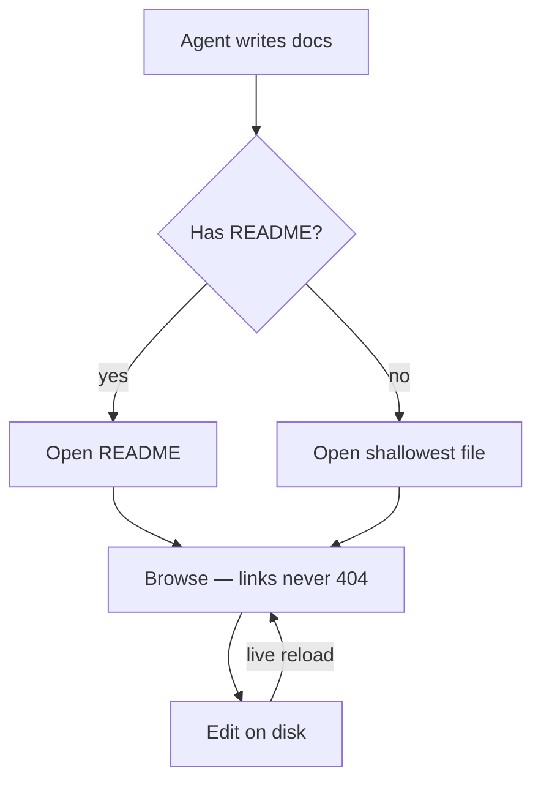
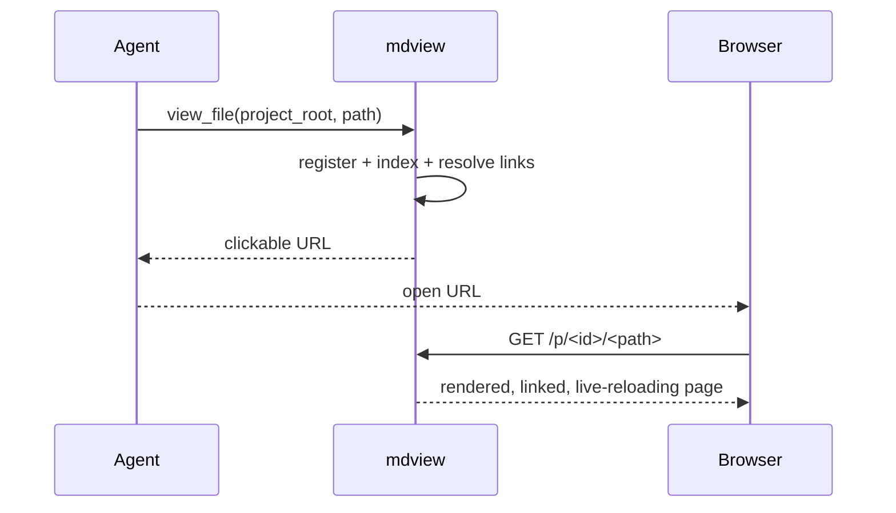

# Mermaid demo

A smoke-test page for diagram rendering + the pan/zoom controls. Open it in
mdview; each diagram should render and show the `+ − ⟲ ⛶` toolbar (top-right of
the diagram) — on mobile the toolbar stays visible, pinch to zoom, drag to pan.

## Flowchart

## Sequence

